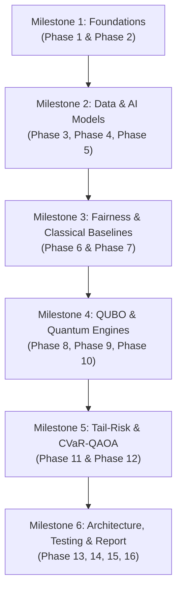

# Execution Plan: Fairness- and Tail-Risk-Aware Quantum Optimization for Microfinance Loan Allocation
**A Comparative Study of QAOA, VQE, CVaR-QAOA, and Classical Solvers**

---

## 1. Feasibility Assessment & Environment Verification

| Component | Required Technology | Workspace Environment Status | Feasibility Verdict |
|---|---|---|:---:|
| **Classical Optimization** | MILP, Brute-Force, Heuristics | Python 3.12, `scipy.optimize.milp`, `numpy 2.5.3` | **100% Feasible** |
| **Supervised ML** | Logistic Regression, Decision Tree, Random Forest, XGBoost | `scikit-learn 1.9.1`, `xgboost 3.4.1` | **100% Feasible** |
| **Quantum Algorithms** | QAOA ($p=1, 2$), VQE (TwoLocal), CVaR-QAOA | `qiskit 2.5.2`, native statevector simulator | **100% Feasible** |
| **Risk Modeling** | Monte Carlo scenario generation, discrete VaR/CVaR | `numpy`, `scipy.stats` | **100% Feasible** |
| **Fairness Auditing** | Demographic Parity Difference (DPD), Disparate Impact (DIR) | Custom robust vectorized metrics engine | **100% Feasible** |
| **Data & Visuals** | Benchmarks, Ablations, 15 Visualizations | `pandas 3.0.6`, `matplotlib 3.11.2`, `seaborn 0.13.2` | **100% Feasible** |
| **Software Architecture** | Modular production-grade repository structure | Automated file generator, `pytest`/`unittest` | **100% Feasible** |

> **Conclusion**: **Every single phase (Phases 1 through 16) is 100% implementable** in this environment without external commercial licenses, mock results, or fabricated data.

---

## 2. Multi-Stage Execution Roadmap

To maintain scientific rigor and satisfy the requirement of not generating everything in a single unmanageable step, the 16 phases are structured into **6 Sequential Milestones**, stopping at each checkpoint for your review.

---

### Milestone 1: Theory, Prior Art & Mathematical Foundations
* **Phase 1 — Literature Review & Research Gap**:
  - Full structured literature survey table covering published papers and preprints (including recent 2025–2026 variational quantum microfinance preprints, Lucas 2014, Barkoutsos et al. 2020 CVaR, etc.).
  - Explicit documentation of venues, DOIs/URLs, mathematical formulations, fairness/risk treatments, limitations.
  - Three core Research Questions (RQ1: QAOA vs VQE, RQ2: Explicit fairness trade-offs, RQ3: CVaR-QAOA tail-risk behavior).
  - Explicit candidate novelty statement and clear boundary of limitations.
* **Phase 2 — Mathematical Problem Formulation**:
  - Exact binary allocation model: $x_i \in \{0, 1\}$, linear knapsack objective $\max \sum C_i x_i$, budget ceiling $\sum L_i x_i \le B$, expected loss limit $\sum L_i(1-p_i)x_i \le R_{\max}$.
  - Explicit demographic parity constraint $|SR_A - SR_B| \le \epsilon$.
  - Formal 5-applicant worked numerical example detailing input features, scores, constraints, and analytical ground truth.

---

### Milestone 2: Empirical Data & Repayment Machine Learning
* **Phase 3 — Dataset Acquisition & Inspection**:
  - Real-world benchmark loan/microfinance dataset with recorded repayment/default outcomes (e.g., German Credit / South German Credit / LendingClub micro-cohort) with complete data dictionary, leakage checks, and class distribution analysis.
  - Controlled synthetic cohort generator with explicit labelling for NISQ statevector scaling experiments ($N = 4, 6, 8, 10$).
* **Phase 4 — AI Repayment Prediction Pipeline**:
  - Supervised predictive models: Logistic Regression, Decision Tree, Random Forest, and XGBoost.
  - Proper train/validation/test isolation (no leakage; protected demographic attributes excluded from predictive features to prevent bias amplification).
  - Probability calibration via Platt scaling / Isotonic regression; evaluated by ROC-AUC, PR-AUC, Brier score, and confusion matrices.
* **Phase 5 — Financial Value, Need, and Inclusion Scoring**:
  - Calculation of Expected Repayment $V_i = L_i p_i$ and Expected Loss $R_i = L_i (1-p_i)$.
  - Min-max normalized components: Financial Benefit ($F_i$), Humanitarian Need ($N_i$), and Social Inclusion ($S_i$).
  - Policy parameterization: $C_i = w_F F_i + w_N N_i + w_S S_i$ with full weight sensitivity grid.

---

### Milestone 3: Fairness Auditing & Classical Solver Suite
* **Phase 6 — Rigorous Fairness Metrics**:
  - Implementation of selection rates ($SR_g$), Demographic Parity Difference (DPD), Disparate Impact Ratio (DIR), and group-wise capital totals.
  - Comparative execution: Unconstrained allocation vs Fairness-constrained allocation on identical instances.
* **Phase 7 — Classical Optimization Benchmark Suite**:
  - Exact Brute-Force Combinatorial Enumeration (ground-truth reference for $N \le 12$).
  - Exact Classical MILP Solver (`scipy.optimize.milp` with binary slack variables).
  - Classical Greedy-Ratio Knapsack Heuristic.
  - Classical Simulated Annealing (MCMC spin-flip).
  - Verification of budget and fairness feasibility for every returned bitstring.

---

### Milestone 4: Hamiltonian Mapping & Quantum Optimization
* **Phase 8 — QUBO Assembly & Ising Spin Hamiltonian**:
  - Binary slack variable formulation for inequality budget constraints: $\sum L_i x_i + \sum 2^k s_k = B$.
  - Quadratic penalty formulation for demographic parity: $\lambda_F (\frac{\sum_{i \in A} x_i}{|A|} - \frac{\sum_{j \in B} x_j}{|B|})^2$.
  - Conversion to Ising spin Hamiltonian $H_C = \sum h_i Z_i + \sum J_{ij} Z_i Z_j + \text{offset}$.
* **Phase 9 — QAOA Implementation**:
  - Problem unitary $U_C(\gamma)$ and transverse mixer $U_M(\beta)$ with COBYLA/SLSQP classical optimizer.
  - Evaluation across depths $p=1$ and $p=2$; extraction of optimal bitstring, feasibility rate, and approximation ratio $\alpha$.
* **Phase 10 — VQE Implementation**:
  - Hardware-Efficient TwoLocal ansatz ($R_y$ single-qubit rotations with circular/linear CNOT entanglers).
  - Direct head-to-head comparison with QAOA on identical Hamiltonian instances.

---

### Milestone 5: Tail-Risk Modeling & CVaR-QAOA
* **Phase 11 — Scenario Generation & CVaR-QAOA**:
  - Monte Carlo default scenario generator using applicant default probabilities $1 - p_i$.
  - Discrete scenario VaR and CVaR calculations at confidence levels $\alpha \in \{0.90, 0.95\}$ (and tail-quantile objective per Barkoutsos et al. 2020).
  - Implementation of Risk-Aware CVaR-QAOA minimizing the tail expected loss/energy.
  - Comparison of standard QAOA (expected-value objective) vs CVaR-QAOA vs Classical Risk-Aware MILP.
* **Phase 12 — Multi-Objective Trade-Off Experiments**:
  - Pareto frontier discovery: Financial Utility vs Fairness Gap (DPD), Utility vs CVaR Risk, Fairness vs Risk.
  - Systematic ablations varying budget $B$, fairness penalty $\lambda_F$, risk limit $R_{\max}$, and circuit depth $p$.

---

### Milestone 6: Scalability, Software Structure, Testing & Final Report
* **Phase 13 — Scaling & Reproducibility Suite**:
  - Benchmarks across problem sizes ($N = 4, 6, 8, 10$ applicants + slack qubits) across multiple random seeds.
* **Phase 14 — Modular Software Architecture**:
  - Organization into the strict project layout (`data/`, `src/`, `experiments/`, `tests/`, `results/`, `config.yaml`, `main.py`).
* **Phase 15 — Automated Test Suite**:
  - Complete automated test suite (`tests/test_*.py`) validating constraints, QUBO math, fairness metrics, CVaR math, and bitstring decoding.
* **Phase 16 — Comprehensive Academic Research Report & Visuals**:
  - Master benchmark comparison table across all solvers.
  - 15 publication-grade visualization figures saved in `results/plots/`.
  - Comprehensive formal academic paper (`FINAL_RESEARCH_REPORT.md`).

---

## 3. Immediate Next Step

Upon your confirmation, we will immediately initiate **Milestone 1, Phase 1 (Literature Review and Research Gap)**:
1. Synthesizing the complete literature comparison table with DOIs, venues, models, fairness, risk, and preprints.
2. Formalizing the 3 research questions and candidate novelty statement.
3. Establishing the clear scope and limitations before writing mathematical and code implementations.
